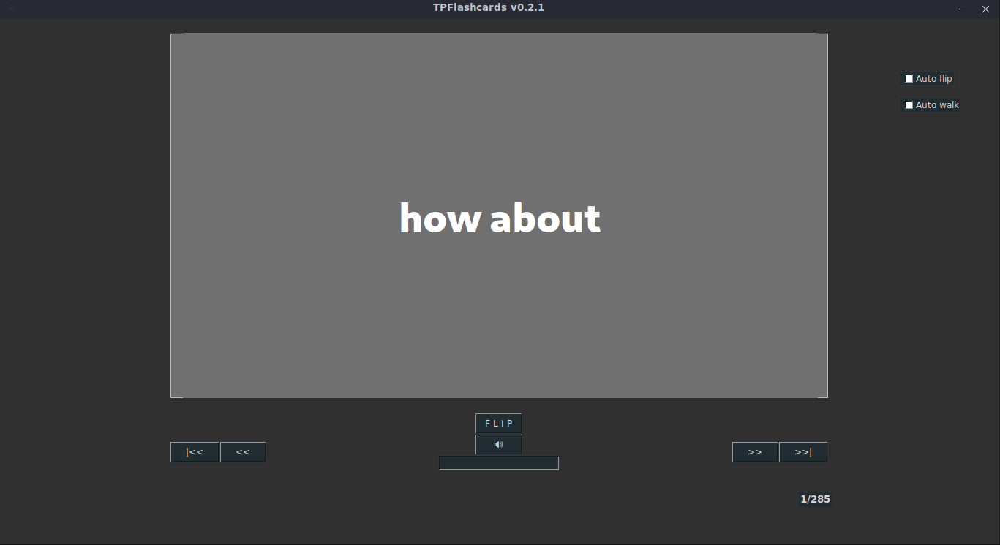

# TPFlashcards

###### Simple flashcards app using Python and Tkinter. Learn any language or stuff you want with flashcards as long as CSV format is adhered!

In the Entry Box shown in the screenshot you can enter a number of a card you want to directly navigate to and hit ENTER.

Dependencies:

 * python > 3.7
 * fonts-symbola
 * ffmpeg (ffplay specifically) - to play sounds 

supported Arguments/flags:

usage: main.py [-h] [-p PATH_TO_DECK] [-f FONT] [-t {bold,normal}] [-z FONT_SIZE] [-s] [-r] [-l FLIPTIME] [-w SWITCHTIME] [-u PATH_TO_FFPLAY]

optional arguments:

  -h, --help            show this help message and exit

  -p PATH_TO_DECK, --path-to-deck PATH_TO_DECK
                        Path to deck and also important for prepending path to sound file

  -f FONT, --font FONT  Name of a font installed on your system

  -t {bold,normal}, --font-style {bold,normal}
                        bold or normal

  -z FONT_SIZE, --font-size FONT_SIZE
                        Well, the font size

  -s, --shuffle         If specified deck will be shuffled at start

  -r, --remove-duplicates
                        Remove duplicates before loading CSV into memory

  -l FLIPTIME, --fliptime FLIPTIME
                        Time in seconds (may be a float) to flip a card.

  -w SWITCHTIME, --switchtime SWITCHTIME
                        Time in seconds (may be a float) to switch between two cards

  -u PATH_TO_FFPLAY, --path-to-ffplay PATH_TO_FFPLAY
                        Path to ffplay binary including the binary itself.

**!!!**

**Although my showcase is for Cantonese and thus quite complicated, HOWEVER as long as you use the same CSV format you can use this application to study any language or material you want. Creating huge decks for more "simple" languages should be easy.**

**!!!**

What the CSV must look like:

 * It has exactly these four columns and ONLY these four columns: id, front_content, back_content, front_sound_file_path
 * The seperator is a semicolon NOT A COMMA
 * Your native language should go in the front_content columns and the foreign language in the back_content column.
 * If the language you're learning has a non roman writing system and you wanna use both romanized (e.g. Pinyin)
   and their native writing system. Please seperate the two by four dashes ----. The native system comes first,
   the romanized writing after the four dashes.
 

Run like this:

    python3 main.py -p <path_to_csv> -f CantarellExtraBold -z 42 -t normal --remove-duplicates --shuffle

###### How I created the cantonese sampledeck that comes with this project

**My sample cantonese deck was created thanks to Cantonese.apkg from anki**, that I exctracted and then
converted using my other projekt . Since it does not work perfectly, I did a lot of manual cleanup to the CSV
and I am still not done.

**To have sound functionality and be able to play the files my sample CSV references in the last column, get Cantonese.apkg from Anki** and extract it. You will get a folder called *Cantonese*. Use the path to that folder as the forth argument
as stated above.

